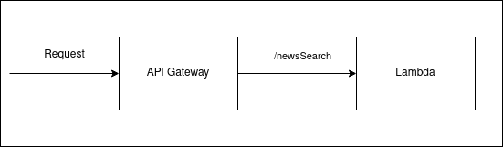

# News Search API

API to search for news stories by topic.

## Contents

1. [Infrastructure](#infrastucture)
2. [API Interface](#api-interface)
3. [News Search Lambda](./news-search-lambda/README.md)
4. [API Gateway](#aws-api-gateway)

## Infrastructure



The API is built using AWS services. This project contains the Cloudformation templates to generate the API infrastructure. The Cloudformation templates are written in javascript using [AWS CDK](https://docs.aws.amazon.com/cdk/).

### Working with AWS CDK

#### Setting up CDK

1. Install the cdk command line tool

```
npm install -g aws-cdk
```

2. Check the tool installed correctly with 

```
cdk --version
```

#### Building the template

In the [cloudformation](./cloudformation) directory run:

```
cdk synth
```

The `cdk.json` file tells the CDK Toolkit how to execute the app and build the Cloudformation template.

`cdk synth`: emits the synthesized CloudFormation templates as `*.template.JSON` files in the [cdk.out](./cloudformation/cdk.out)  directory.

## API Interface

The API interface is defined using the [Open API](https://swagger.io/docs/specification/about/) specification. The specification is [here](./apiSpecification.yml).

## AWS API Gateway

Creating the API Gateway in AWS

1. Create REST API
2. Import [spec](./apiSpecification.yml)
3. Connect up the /newsSearch endpoint to the news-search-lambda and use 'Lambda Proxy integration'
4. Under `Actions` deploy API creating a new Stage in the process
5. Create a Usage Plan and associate it with the API and Stage just created
6. Add an API Key to the Usage Plan
